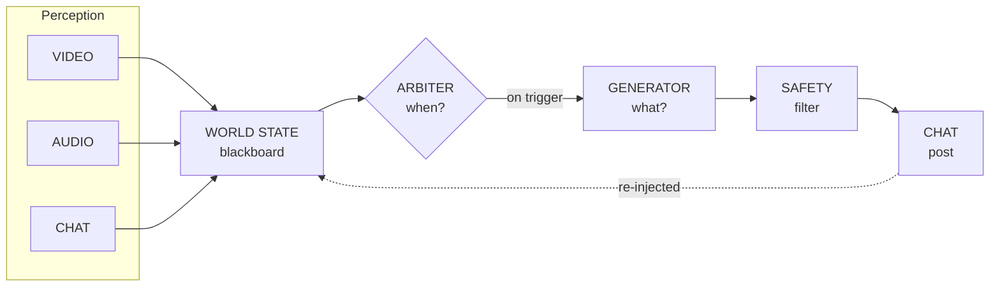

<a id="readme-top"></a>

<!-- PROJECT SHIELDS -->
[![Contributors][contributors-shield]][contributors-url]
[![Forks][forks-shield]][forks-url]
[![Stargazers][stars-shield]][stars-url]
[![Issues][issues-shield]][issues-url]
[![Python][python-shield]][python-url]


<!-- PROJECT LOGO -->
<br />
<div align="center">
  <a href="https://github.com/OxMarco/Lingus">
    
  </a>

  <h3 align="center">Lingus</h3>

  <p align="center">
    A real-time, characterful live-stream interaction bot — perceives a stream (video + audio + chat), decides <em>when</em> to speak and <em>what</em> to say, and posts to chat. Personality over coverage.
    <br />
    <a href="./CLAUDE.md"><strong>Explore the design spec »</strong></a>
    <br />
    <br />
    <a href="#usage">View Demo</a>
    &middot;
    <a href="https://github.com/OxMarco/Lingus/issues/new?labels=bug">Report Bug</a>
    &middot;
    <a href="https://github.com/OxMarco/Lingus/issues/new?labels=enhancement">Request Feature</a>
  </p>
</div>


<!-- TABLE OF CONTENTS -->
<details>
  <summary>Table of Contents</summary>
  <ol>
    <li>
      <a href="#about-the-project">About The Project</a>
      <ul>
        <li><a href="#architecture">Architecture</a></li>
        <li><a href="#built-with">Built With</a></li>
      </ul>
    </li>
    <li>
      <a href="#getting-started">Getting Started</a>
      <ul>
        <li><a href="#prerequisites">Prerequisites</a></li>
        <li><a href="#installation">Installation</a></li>
      </ul>
    </li>
    <li><a href="#usage">Usage</a></li>
    <li><a href="#roadmap">Roadmap</a></li>
    <li><a href="#contributing">Contributing</a></li>
    <li><a href="#license">License</a></li>
    <li><a href="#contact">Contact</a></li>
    <li><a href="#acknowledgments">Acknowledgments</a></li>
  </ol>
</details>


<!-- ABOUT THE PROJECT -->
## About The Project

Lingus watches a live stream through three channels — video, audio, and chat —
fuses them into a coherent picture of "what's happening right now," and decides when
it's worth saying something. When it is, it generates a short, in-character message
and posts it to chat. It remembers the stream so far (and prior streams) so it can
make callbacks, sustain running jokes, and feel like a familiar presence rather than
a stateless responder.

It's built as a **perception–cognition loop on a clock**, not a request/response
system. The hard problems are about *timing*, not any single perception module:

* **Perception** writes to a shared, timestamped world-state; **cognition** reads
  state, never raw streams.
* **"Should I speak?"** (a cheap, always-on *arbiter*) is a separate decision from
  **"What do I say?"** (an expensive *generator* that only runs when the arbiter fires).
* **Personality** is distributed across three subsystems — arbiter *timing*,
  generator *voice*, and memory *callbacks* — not just the prompt.
* Every generated message passes a deterministic **safety filter** and **output
  governor** (rate + length caps) before it is posted.

<p align="right">(<a href="#readme-top">back to top</a>)</p>

### Architecture



* **Adapters** (`adapters/`) abstract the platform: file-replay + YouTube (Twitch later).
* **Model backends** (`models/`) abstract the models: small ones local (ASR, VLM),
  the generator hosted (OpenAI-compatible — GPT-5.5 / Grok).
* **Memory** (`memory/`) spans four layers: working buffer, episodic summarization,
  durable semantic facts (cross-stream), and self-memory + dedup.

<p align="right">(<a href="#readme-top">back to top</a>)</p>

### Built With

* [![Python][python-shield]][python-url]
* [faster-whisper](https://github.com/SYSTRAN/faster-whisper) — streaming ASR
* [yt-dlp](https://github.com/yt-dlp/yt-dlp) + [PyAV](https://github.com/PyAV-Org/PyAV) — stream capture
* [Pydantic](https://docs.pydantic.dev/) — config + schemas
* [OpenAI-compatible client](https://github.com/openai/openai-python) — hosted generator

<p align="right">(<a href="#readme-top">back to top</a>)</p>


<!-- GETTING STARTED -->
## Getting Started

To get a local copy up and running, follow these steps.

### Prerequisites

* Python 3.12+
* A virtualenv (Phase 0 installs and runs with nothing else; heavy deps are optional extras)

### Installation

1. Clone the repo
   ```sh
   git clone https://github.com/OxMarco/Lingus.git
   cd Lingus
   ```
2. Create and activate a virtualenv
   ```sh
   python -m venv venv
   source venv/bin/activate
   ```
3. Install the package (core + dev tooling)
   ```sh
   pip install -e ".[dev]"
   ```
4. Install optional extras for later phases as needed
   ```sh
   pip install -e ".[asr,youtube,llm]"
   ```
5. Copy the env template and fill in keys when wiring Phase 1
   ```sh
   cp .env.example .env
   ```

<p align="right">(<a href="#readme-top">back to top</a>)</p>


<!-- USAGE EXAMPLES -->
## Usage

Run the loop offline from a recorded segment — no network or API keys required:

```sh
python -m lingus.app --segment tests/samples/demo
```

You should see the world-state populate with chat + transcript events, then a simple
offline cognition tick may post a deterministic bot reply.

```sh
python -m lingus.app --segment tests/samples/cake --speed 100
```

This sample replays scene + speech context for a chocolate-cake stain and logs the
bot's reply through the file replay chat adapter.

### Run against a live YouTube stream

Lingus runs in **observe mode** here: it pulls the stream's **audio** (→ ASR) and
**live chat** (keyless), runs the full arbiter → generator → safety → governor
pipeline, and **logs the reply it *would* post** — it does not write to chat.
(Posting needs OAuth and lands with the posting/Twitch adapter; `ObserveChatAdapter`
is read-only by design.)

1. Install the runtime extras:
   ```sh
   pip install -e ".[asr,youtube,llm]"
   # optional: ".[research]" (channel pre-profiling), ".[dashboard]" / ".[web]" (live tuning UI)
   ```
2. Configure the generator (optional — without a key it falls back to a deterministic
   template, which validates the loop but is not the personality). In `.env`:
   ```sh
   OPENAI_API_KEY=sk-...
   OPENAI_BASE_URL=            # blank for OpenAI; https://api.x.ai/v1 for Grok; etc.
   ```
   Match `models.llm.model` in `config.yaml` to your provider. The safety gate
   (`moderation.backend: regex`) and live-chat ingestion (`youtube.chat_enabled: true`)
   are on by default — leave them on.
3. Point it at a **currently-live** stream (URL or video ID):
   ```sh
   python -m lingus.app --platform youtube --video "https://www.youtube.com/watch?v=<LIVE_ID>"
   ```

Useful flags: `--language it|en|auto` (pin ASR language; default `en`),
`--asr-model small|medium|large-v3` (only `medium` is cached — others re-download),
`--research` / `--no-research` (force or skip cold-start channel profiling),
`--dashboard` or `--web --web-port 8080` (live view of world-state, arbiter scores,
and would-be posts).

> **Caveats.** The stream must be **live** (VODs give no chat continuation); the first
> run downloads the ASR model unless `medium` is cached; on Apple Silicon ASR runs
> CPU/int8 (no Metal), which is why `medium`/10s-window is the tuned default; video is
> not wired yet (Phase 4), so this is audio + chat only.

Run the test suite and linter:

```sh
pytest
ruff check src tests
```

<p align="right">(<a href="#readme-top">back to top</a>)</p>


<!-- ROADMAP -->
## Roadmap

- [x] **Phase 0** — skeleton: config, world-state, persona schema, adapter/model ABCs, offline loop
- [x] **Phase 0.5** — context snapshot, simple arbiter, deterministic offline reply loop
- [ ] **Phase 1** — speech → reply → chat: capture + local ASR + hosted/template generator + governor wired and validated live in observe mode
    - Remaining: validate the real LLM generator live; post path lands with the Twitch adapter
- [x] **Phase 2** — chat perception: `ChatTrendDetector` (hype/pile-on) built and wired into the arbiter; keyless YouTube live-chat ingestion (`YouTubeLiveChatClient`) wired into `ObserveChatAdapter`
- [x] **Phase 3** — memory: working + self-memory + dedup/bit-fatigue + episodic summarization + semantic (durable cross-stream facts)
- [ ] **Phase 4** — video: frame gating + VLM scene state — `youtube.py` `video_frames()` is a stub
- [ ] **Phase 5** — hardening
    - Done: output moderation pass (`RegexModeration`, authoritative gate in the post path); output governor (rate + length caps)
    - Remaining: mid-flight staleness/barge-in abort, per-signal cooldowns, guard-model moderation backend
- [x] **Phase 6** — eval loop: record / replay / judge (`--eval`, heuristic + LLM-as-judge)
- [x] **Cold-start research** — profile the channel pre-loop and seed durable memory (`research/`, per-channel cache)
- [ ] **Final** — Twitch adapter

See the [open issues](https://github.com/OxMarco/Lingus/issues) for a full list of
proposed features (and known issues).

<p align="right">(<a href="#readme-top">back to top</a>)</p>


<!-- CONTRIBUTING -->
## Contributing

Contributions are what make the open source community such an amazing place to learn,
inspire, and create. Any contributions you make are **greatly appreciated**.

If you have a suggestion that would make this better, please fork the repo and create
a pull request. You can also simply open an issue with the tag "enhancement".

1. Fork the Project
2. Create your Feature Branch (`git checkout -b feature/AmazingFeature`)
3. Commit your Changes (`git commit -m 'Add some AmazingFeature'`)
4. Push to the Branch (`git push origin feature/AmazingFeature`)
5. Open a Pull Request

<p align="right">(<a href="#readme-top">back to top</a>)</p>


<!-- LICENSE -->
## License

Distributed under the project license. See `LICENSE` for more information.

<p align="right">(<a href="#readme-top">back to top</a>)</p>


<!-- CONTACT -->
## Contact

OxMarco - [@OxMarco](https://github.com/OxMarco)

Project Link: [https://github.com/OxMarco/Lingus](https://github.com/OxMarco/Lingus)

<p align="right">(<a href="#readme-top">back to top</a>)</p>


<!-- ACKNOWLEDGMENTS -->
## Acknowledgments

* [Best-README-Template](https://github.com/othneildrew/Best-README-Template)
* [SillyTavern character cards + lorebooks](https://github.com/SillyTavern/SillyTavern) — persona design reference
* [Pipecat](https://github.com/pipecat-ai/pipecat) — pipeline spine inspiration
* [faster-whisper](https://github.com/SYSTRAN/faster-whisper)

<p align="right">(<a href="#readme-top">back to top</a>)</p>


<!-- MARKDOWN LINKS & IMAGES -->
[contributors-shield]: https://img.shields.io/github/contributors/OxMarco/Lingus.svg?style=for-the-badge
[contributors-url]: https://github.com/OxMarco/Lingus/graphs/contributors
[forks-shield]: https://img.shields.io/github/forks/OxMarco/Lingus.svg?style=for-the-badge
[forks-url]: https://github.com/OxMarco/Lingus/network/members
[stars-shield]: https://img.shields.io/github/stars/OxMarco/Lingus.svg?style=for-the-badge
[stars-url]: https://github.com/OxMarco/Lingus/stargazers
[issues-shield]: https://img.shields.io/github/issues/OxMarco/Lingus.svg?style=for-the-badge
[issues-url]: https://github.com/OxMarco/Lingus/issues
[python-shield]: https://img.shields.io/badge/Python-3.12+-3776AB?style=for-the-badge&logo=python&logoColor=white
[python-url]: https://www.python.org/
