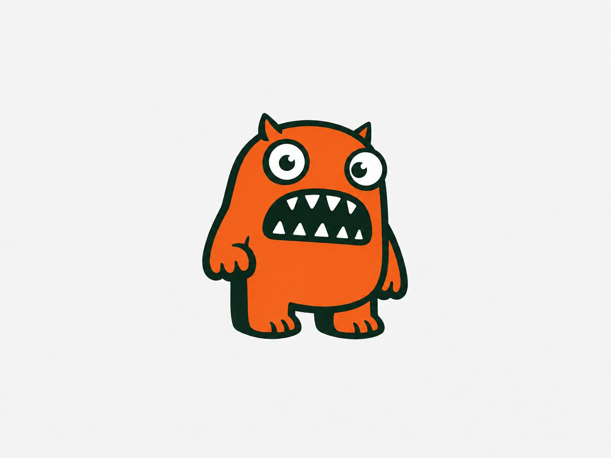
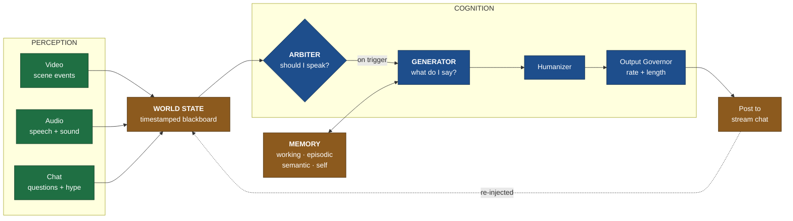
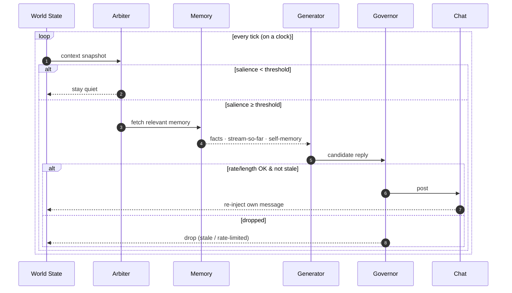

<a id="readme-top"></a>

<!-- PROJECT SHIELDS -->
[![Contributors][contributors-shield]][contributors-url]
[![Forks][forks-shield]][forks-url]
[![Stargazers][stars-shield]][stars-url]
[![Issues][issues-shield]][issues-url]
[![Python][python-shield]][python-url]
![Tests][tests-shield]
![Ruff][ruff-shield]


<!-- PROJECT LOGO -->
<br />
<div align="center">
  <a href="https://github.com/OxMarco/Lingus">
    
  </a>

  <h3 align="center">Lingus</h3>

  <p align="center">
    A live-stream bot that watches the video, listens to the audio, reads the chat, and picks its moments to say something in character.
    <br />
    <strong>Built for personality, not coverage.</strong>
    <br />
    <br />
    <a href="./CLAUDE.md"><strong>Explore the design spec »</strong></a>
    <br />
    <br />
    <a href="#-usage">View Demo</a>
    &middot;
    <a href="https://github.com/OxMarco/Lingus/issues/new?labels=bug">Report Bug</a>
    &middot;
    <a href="https://github.com/OxMarco/Lingus/issues/new?labels=enhancement">Request Feature</a>
  </p>
</div>


<!-- TABLE OF CONTENTS -->
<details>
  <summary>Table of Contents</summary>
  <ol>
    <li><a href="#-about-the-project">About The Project</a></li>
    <li><a href="#-features">Features</a></li>
    <li>
      <a href="#-architecture">Architecture</a>
      <ul>
        <li><a href="#the-cognition-tick">The cognition tick</a></li>
        <li><a href="#memory-architecture">Memory architecture</a></li>
      </ul>
    </li>
    <li><a href="#-built-with">Built With</a></li>
    <li>
      <a href="#-getting-started">Getting Started</a>
      <ul>
        <li><a href="#prerequisites">Prerequisites</a></li>
        <li><a href="#installation">Installation</a></li>
      </ul>
    </li>
    <li><a href="#-usage">Usage</a></li>
    <li><a href="#-roadmap">Roadmap</a></li>
    <li><a href="#-contributing">Contributing</a></li>
    <li><a href="#-license">License</a></li>
    <li><a href="#-contact">Contact</a></li>
    <li><a href="#-acknowledgments">Acknowledgments</a></li>
  </ol>
</details>


<!-- ABOUT THE PROJECT -->
## About The Project

**Lingus** follows a live stream on three channels at once: video, audio, and chat. It
stitches them into one picture of what's happening right now, works out whether that
picture is worth reacting to, and if it is, writes a short in-character line and drops
it into chat. It also keeps notes on the stream so far, and on past streams, so it can
call back to old jokes and feel like a regular in the room instead of a bot that answers
when poked.

The core idea is that it runs on a clock. It isn't a chatbot waiting for a prompt, it's a
loop that decides for itself when to speak. Most of the hard parts are about timing, not
about any one perception module. A few decisions shape everything else:

| Principle | What it means |
|---|---|
| **Runs on a clock** | The bot ticks on its own schedule and chooses when to react. Nobody prompts it. |
| **Shared blackboard** | Perception writes a timestamped world-state. Cognition reads that state and never touches the raw streams. |
| **Two separate questions** | "Should I speak?" is a cheap arbiter that runs constantly. "What do I say?" is an expensive generator that only runs when the arbiter says yes. |
| **Personality is spread out** | Character comes from arbiter timing, generator voice, and memory callbacks. It isn't just a prompt. |
| **A hard last step** | Every message goes through an output governor for rate and length before it posts. No model decision can skip it. |

<p align="right">(<a href="#readme-top">back to top</a>)</p>


## Features

<table>
<tr>
<td width="50%" valign="top">

### Perception
- **Streaming ASR.** Local faster-whisper with Silero VAD, so it cuts on pauses instead of chopping words in half.
- **Pre-ASR audio gate.** Drops silence and music windows before they reach Whisper, so song lyrics don't leak into the transcript.
- **Hallucination filter.** Throws out Whisper's phantom phrases on music and silence.
- **Video scene-state.** RGB frame-diff gating feeds a local MLX-VLM (Qwen2.5-VL) that reports what changed on screen, not a caption per frame.
- **Chat aggregation.** The firehose gets boiled down to questions aimed at the bot, hype and pile-on spikes, and topics as they emerge.

</td>
<td width="50%" valign="top">

### Cognition
- **Heuristic arbiter.** Scores salience from direct mentions, questions, hype, scene events, and lulls, with a cooldown that climbs each time it speaks.
- **Persona generator.** A structured persona spec, an exemplar bank, and the relevant memory go in; a short in-character line comes out.
- **Bounded mood.** A slowly decaying energy value that nudges the arbiter's thresholds and the generator's phrasing.
- **Humanizer.** Strips the machine-written tells (em dashes, smart quotes, single-glyph ellipses) and can add human-shaped typos.
- **In-character plugs.** Product mentions that only surface when the live context already fits, spaced out so they can't take over.

</td>
</tr>
<tr>
<td width="50%" valign="top">

### Memory
- **Working buffer.** The last few minutes of transcript, scene, and chat, fed straight into context.
- **Episodic summaries.** Old transcript gets folded into a running "stream so far" so long streams don't blow the context window.
- **Cross-stream memory.** Per-stream summaries and durable facts are saved and reloaded, scoped per channel so one stream's notes don't bleed into another's.
- **Self-memory and dedup.** Tracks its own recent lines and joke fatigue so it doesn't repeat itself.
- **Cold-start research.** Profiles the channel before the loop starts and seeds memory, so it walks in already knowing the place.

</td>
<td width="50%" valign="top">

### Output & Tooling
- **Output governor.** Token-bucket rate limit, a hard minimum gap between posts, and a sentence-aware length cap. It drops stale replies rather than queueing them.
- **Live dashboards.** A Rich terminal view and a browser tuner, both fed off the same tick stream, so you can watch the salience bar move.
- **Live tuning.** Change how chatty it is, flip posting on or off, or tweak raw params from the browser. It lands on the next tick, no restart.
- **Eval harness.** Replays recorded segments through the real loop and scores each line on staying in character, not sounding generic, and not repeating.
- **Adapter seams.** File-replay, YouTube (keyless chat), and Twitch (write path) all sit behind clean interfaces.

</td>
</tr>
</table>

<p align="right">(<a href="#readme-top">back to top</a>)</p>


## Architecture

Perception modules run at very different rates, so they all write into one timestamped
blackboard instead of talking to each other. Cognition reads a snapshot of that board
and never sees the raw streams. Any single module can fail without taking the rest down,
and the model always gets one clean, time-aligned view.



> Whatever the bot posts goes back into the world state, so it can see its own lines,
> avoid repeating them, and follow its own thread.

* **Adapters** (`adapters/`) hide the platform. Today that's file-replay, YouTube, and Twitch.
* **Model backends** (`models/`) hide the models. The small ones run locally (ASR, VLM,
  audio gate); the generator is hosted over an OpenAI-compatible API (GPT, Grok, and so on).
* **Safety** is left to the hosted generator's own refusals. There's no local moderation
  pass. See [`CLAUDE.md §2.9`](./CLAUDE.md) for why.

### The cognition tick



### Memory architecture

Four layers, each built for its own job. RAG and vector search only ever touch the
semantic layer:

| Layer | What it holds | How it's built |
|---|---|---|
| **Working** | last few minutes of transcript, scene states, chat highlights | rolling buffer on `WorldState`, fed straight into context |
| **Episodic** | the "stream so far" plus past-stream summaries | old working memory gets summarized into `.lingus/episodes.json` |
| **Semantic** | durable facts: the streamer, regulars, running bits | hand-rolled token-overlap retrieval in `.lingus/semantic.json`, loaded across streams |
| **Self-memory** | the bot's own recent lines | fed back in, with dedup and joke-fatigue tracking |

<p align="right">(<a href="#readme-top">back to top</a>)</p>


## Built With

[![Python][python-shield]][python-url]

| | |
|---|---|
| **ASR** | [faster-whisper](https://github.com/SYSTRAN/faster-whisper), streaming, VAD-segmented |
| **Capture** | [yt-dlp](https://github.com/yt-dlp/yt-dlp), [PyAV](https://github.com/PyAV-Org/PyAV), FFmpeg |
| **Vision** | [MLX-VLM](https://github.com/Blaizzy/mlx-vlm) running Qwen2.5-VL locally on Apple Silicon |
| **Generator** | [OpenAI-compatible client](https://github.com/openai/openai-python) with [Instructor](https://github.com/567-labs/instructor) for structured output |
| **Chat** | keyless YouTube InnerTube, [TwitchIO](https://github.com/PythonistaGuild/TwitchIO), [Streamlink](https://github.com/streamlink/streamlink) |
| **Core** | [Pydantic](https://docs.pydantic.dev/) schemas, [Tenacity](https://tenacity.readthedocs.io/) for retries |
| **Dashboards** | [Rich](https://github.com/Textualize/rich) terminal, [aiohttp](https://docs.aiohttp.org/) web sidecar |

<p align="right">(<a href="#readme-top">back to top</a>)</p>


<!-- GETTING STARTED -->
## Getting Started

Here's how to get a copy running locally.

### Prerequisites

* **Python 3.12 or 3.13.** The live ASR stack has no 3.14 wheels yet.
* **A virtualenv.** Phase 0 runs on the core install alone; the heavy stuff is optional extras.
* **Apple Silicon** if you want local video (MLX-VLM needs Metal). Optional otherwise.

### Installation

1. **Clone** the repo
   ```sh
   git clone https://github.com/OxMarco/Lingus.git
   cd Lingus
   ```
2. **Create and activate** a virtualenv
   ```sh
   python3.12 -m venv .venv312
   source .venv312/bin/activate
   ```
3. **Install** the package with dev tooling
   ```sh
   pip install -e ".[dev]"
   ```
4. **Add extras** as you need them
   ```sh
   pip install -e ".[asr,youtube,llm,video-mlx]"
   ```
   <details><summary>What each extra pulls in</summary>

   | Extra | Purpose |
   |---|---|
   | `asr` | faster-whisper ASR plus the lightweight spectral audio gate |
   | `audio-ml` | optional Hugging Face AudioSet speech/music gate |
   | `youtube` | yt-dlp/PyAV capture and keyless live-chat ingestion |
   | `llm` | hosted OpenAI-compatible generator and structured output |
   | `video` / `video-mlx` | OpenCV frame gating / local MLX-VLM scene state |
   | `twitch` | Streamlink for A/V, TwitchIO for chat (write path) |
   | `research` | live web search for cold-start channel profiling |
   | `dashboard` / `web` | Rich terminal dashboard / browser tuner |
   | `memory` | Chroma vector store for the semantic layer (optional) |
   </details>
5. **Copy** the env template and fill in keys when you wire up Phase 1
   ```sh
   cp .env.example .env
   ```

<p align="right">(<a href="#readme-top">back to top</a>)</p>


<!-- USAGE EXAMPLES -->
## Usage

### Offline replay, no network or keys

```sh
python -m lingus.app --segment tests/samples/demo
```

You'll see the world-state fill up with chat and transcript events, and a simple offline
tick may post a deterministic reply.

```sh
python -m lingus.app --segment tests/samples/cake --speed 100
```

This one replays the scene and speech around a chocolate-cake stain and logs the bot's
reply through the file-replay chat adapter.

### Live YouTube stream (observe mode)

In observe mode the bot pulls the stream's audio (into ASR) and its live chat (keyless),
runs the full arbiter → generator → humanizer → governor path, and logs the reply it
*would* post. It doesn't write to chat. Posting needs OAuth and lands with the Twitch and
posting adapters; `ObserveChatAdapter` is read-only on purpose.

1. **Install** the runtime extras:
   ```sh
   pip install -e ".[asr,youtube,llm]"
   # optional: ".[research]" for channel pre-profiling, ".[dashboard]" or ".[web]" for the tuning UI
   ```
2. **Configure** the generator. This is optional: with no key it falls back to a
   deterministic template, which proves the loop works but isn't the personality. In `.env`:
   ```sh
   OPENAI_API_KEY=sk-...
   OPENAI_BASE_URL=            # blank for OpenAI, https://api.x.ai/v1 for Grok, etc.
   ```
   Set `models.llm.model` in `config.yaml` to match your provider. Live-chat ingestion
   (`youtube.chat_enabled: true`) is on by default; leave it on.
3. **Point it** at a stream that's live right now (URL or video ID):
   ```sh
   python -m lingus.app --platform youtube --video "https://www.youtube.com/watch?v=<LIVE_ID>"
   ```

<details>
<summary>Handy flags</summary>

| Flag | Effect |
|---|---|
| `--language it\|en\|auto` | Pin the ASR language (default `en`) |
| `--asr-model small\|medium\|large-v3\|turbo` | Pick the ASR model. This checkout targets `turbo`; uncached models download on first use. |
| `--research` / `--no-research` | Force or skip the cold-start channel profiling |
| `--vlm-backend mlx_vlm\|none` | Turn local video scene-state on or off |
| `--vlm-model <mlx-model>` | Swap the VLM (for example the slower `…7B-Instruct-4bit` for high-detail offline checks) |
| `--dashboard` | Live Rich terminal view of world-state, arbiter scores, and would-be posts |
| `--web --web-port 8080` | Browser tuner: watch the loop and steer it live |
| `--eval --segment <dir> [--eval-json out.json]` | Replay and score a recorded segment |
</details>

Audio is gated before ASR so music beds and lyrics never become context. The default
config uses the lightweight `spectral` gate; install `".[audio-ml]"` if you want the
`hf_ast` Hugging Face AudioSet gate instead.

> [!WARNING]
> **A few things to know.** The stream has to be live (VODs give no chat continuation).
> The first run downloads any ASR or VLM model you don't already have. On Apple Silicon
> the ASR runs on CPU in int8 (no Metal), so validate `turbo` at a 10s window on the
> first run. Video analysis is local, defaulting to MLX-VLM with
> `mlx-community/Qwen2.5-VL-3B-Instruct-4bit`. There's no colour-only fallback: if the
> VLM can't load, the run stops instead of quietly degrading. Set
> `models.vlm.backend=none` to run without video where Metal isn't available.

### Tests and linter

```sh
pytest                    # 267 tests
ruff check src tests      # clean
```

<p align="right">(<a href="#readme-top">back to top</a>)</p>


<!-- ROADMAP -->
## Roadmap

- [x] **Phase 0**: skeleton: config, world-state, persona schema, adapter/model interfaces, offline loop
- [x] **Phase 0.5**: context snapshot, simple arbiter, deterministic offline reply loop
- [x] **Phase 1**: speech to reply to chat: capture, local ASR, hosted/template generator, governor. Validated live in observe mode.
- [x] **Phase 2**: chat perception: `ChatTrendDetector` (hype and pile-on) wired into the arbiter; keyless YouTube live-chat ingestion
- [x] **Phase 3**: memory: working, self-memory, dedup and bit-fatigue, episodic summarization, durable cross-stream facts
- [x] **Phase 3.5**: memory hardening: durable per-stream summaries, still with no vector/RAG database
- [x] **Phase 4**: video: RGB frame capture, deterministic frame gate, local MLX-VLM scene state reporting changes into world state
- [x] **Phase 5**: lean hardening: pre-ASR speech/music gate, output governor (rate and length), humanizer
- [x] **Phase 6**: eval loop: record, replay, judge (`--eval`, local heuristic judge)
- [x] **Cold-start research**: profile the channel before the loop and seed durable memory
- [ ] **Phase 7**: platform write path: Twitch adapter scaffolded (opt-in posting). YouTube OAuth posting and a Kick adapter still to go.
- [ ] **Phase 8**: live validation and regression testing: validate the hosted generator live, widen keyless YouTube chat coverage, tune video latency, build up an eval regression segment library

See the [open issues](https://github.com/OxMarco/Lingus/issues) for the full list of
proposed features and known bugs.

<p align="right">(<a href="#readme-top">back to top</a>)</p>


<!-- CONTRIBUTING -->
## Contributing

Contributions are welcome. If you've got an idea that would make this better, fork the
repo and open a pull request, or just open an issue with the `enhancement` tag.

1. Fork the project
2. Create a feature branch (`git checkout -b feature/AmazingFeature`)
3. Commit your changes (`git commit -m 'Add some AmazingFeature'`)
4. Push the branch (`git push origin feature/AmazingFeature`)
5. Open a pull request

<p align="right">(<a href="#readme-top">back to top</a>)</p>


<!-- LICENSE -->
## License

Distributed under the project license. See `LICENSE` for details.

<p align="right">(<a href="#readme-top">back to top</a>)</p>


<!-- CONTACT -->
## Contact

OxMarco, [@OxMarco](https://github.com/OxMarco)

Project link: [https://github.com/OxMarco/Lingus](https://github.com/OxMarco/Lingus)

<p align="right">(<a href="#readme-top">back to top</a>)</p>


<!-- ACKNOWLEDGMENTS -->
## Acknowledgments

* [Best-README-Template](https://github.com/othneildrew/Best-README-Template)
* [SillyTavern character cards and lorebooks](https://github.com/SillyTavern/SillyTavern), the persona design reference
* [Pipecat](https://github.com/pipecat-ai/pipecat), the pipeline-spine inspiration
* [faster-whisper](https://github.com/SYSTRAN/faster-whisper)

<p align="right">(<a href="#readme-top">back to top</a>)</p>


<!-- MARKDOWN LINKS & IMAGES -->
[contributors-shield]: https://img.shields.io/github/contributors/OxMarco/Lingus.svg?style=for-the-badge
[contributors-url]: https://github.com/OxMarco/Lingus/graphs/contributors
[forks-shield]: https://img.shields.io/github/forks/OxMarco/Lingus.svg?style=for-the-badge
[forks-url]: https://github.com/OxMarco/Lingus/network/members
[stars-shield]: https://img.shields.io/github/stars/OxMarco/Lingus.svg?style=for-the-badge
[stars-url]: https://github.com/OxMarco/Lingus/stargazers
[issues-shield]: https://img.shields.io/github/issues/OxMarco/Lingus.svg?style=for-the-badge
[issues-url]: https://github.com/OxMarco/Lingus/issues
[python-shield]: https://img.shields.io/badge/Python-3.12+-3776AB?style=for-the-badge&logo=python&logoColor=white
[python-url]: https://www.python.org/
[tests-shield]: https://img.shields.io/badge/tests-267_passing-2ea44f?style=for-the-badge&logo=pytest&logoColor=white
[ruff-shield]: https://img.shields.io/badge/lint-ruff-261230?style=for-the-badge&logo=ruff&logoColor=white
